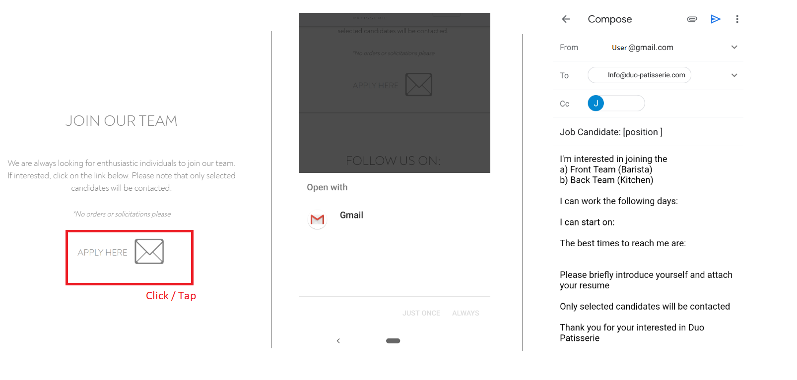
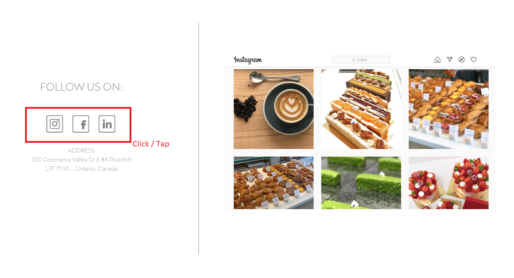
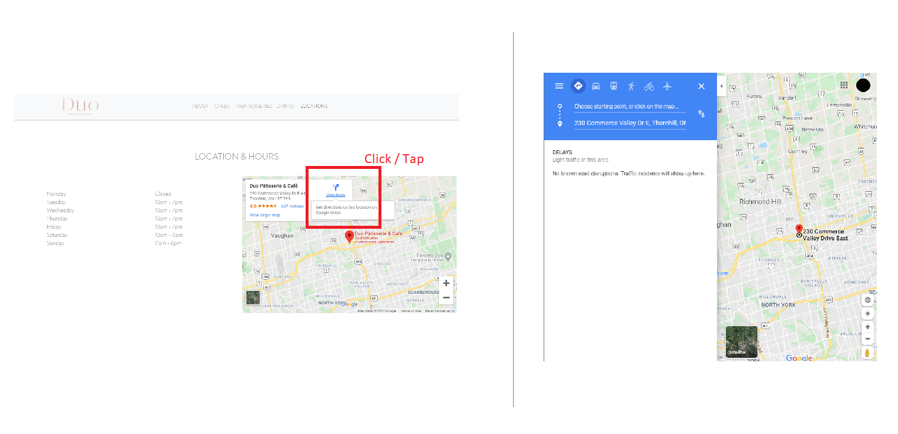

# Duo Patisserie & Cafe Website
### Overview
ReactJS website made for Duo Patisserie & Cafe. 

## Live Site

*Pending custom domain name*
## Technologies and Libraries

* ReactJS
* Webpack
* Bootstrap
* HTML5
* CSS3

### Demo
Official Duo Patisserie & Cafe website (pending custom domain name)

--- 

      

      

      

 

   

--- 

### Mobile Responsiveness

--- 

   

   

   

--- 

### Features

--- 
 Upon clicking the 'Apply Here' icon

   

The user's default email application will open to display the following email.

  
  
  

The following icons redirects to the business' corresponding social media account.

   

Upon clicking/tapping the phone number, the user's device will automatically be redirected so the user may make a phone call. 

   
   

Upon clicking/tapping the 'Directions' link, the user's device will automatically be redirected to Google Maps for navigation. 

   

---
## Authors
* **Tiffany Lin**         [Tiffolin](https://github.com/Tiffolin)

## License
MIT
